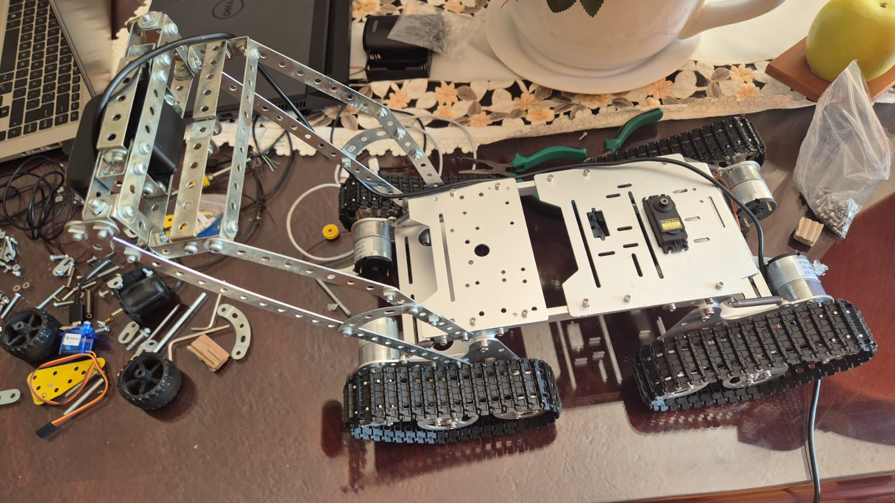

# E.C.O.B.O.T. (Environmental Cleanup & Object-sorting BOT)


[](https://robodk.com/)
[](https://cyberbotics.com/)


E.C.O.B.O.T. (Environmental Cleanup & Object-sorting BOT) is an autonomous mobile robot designed to detect, collect, and classify inorganic waste—such as metal, plastic, and cardboard—in urban parks and public spaces. 

Developed by students from Universidad de las Américas Puebla (UDLAP), E.C.O.B.O.T. demonstrates the use of robotics and AI to tackle real-world environmental challenges.

---

## 📋 Prerequisites

- Basic knowledge of:
  - Digital electronics
  - Programming in Python and C++ (ROS and Arduino)
  - Computer vision fundamentals
  - CAD and 3D printing tools

- Required tools:
  - Multimeter
  - Soldering iron
  - 3D printer (FDM)
  - Precision screwdriver set
  - Laptop or PC with Ubuntu 20.04+

- Required components:
  - Arduino Uno or Mega
  - Raspberry Pi 4
  - MG996R Servomotors
  - 12V DC Motors
  - L293D Motor Driver
  - USB 1080p Camera
  - 12V 5000mAh Li-Ion Battery
  - Proximity, capacitive, and inductive sensors
  - 3D printed mechanical structure

- Required software:
  - Arduino IDE
  - ROS Noetic
  - OpenCV
  - Python 3
  - Fusion 360 or FreeCAD (optional)

---

## 📖 Introduction

E.C.O.B.O.T. is an autonomous robot designed to assist in waste management in urban public spaces, particularly parks. Its purpose is to detect, collect, and classify solid waste (metals, plastics, and cardboard) using computer vision, sensors, and autonomous navigation. Inspired by the UN Sustainable Development Goal 11, it aims to support cleaner and more sustainable cities through robotic automation.

---

## 🔩 Materials

| Component                        | Quantity |
|----------------------------------|----------|
| Raspberry Pi 4                   | 1        |
| Arduino Uno/Mega                 | 1        |
| USB Camera (1080p)               | 1        |
| 12V DC Motors                    | 4        |
| MG996R Servomotors               | 5        |
| L293D Motor Driver               | 1        |
| Proximity/Capacitive/Inductive Sensors | Several  |
| 12V 5000mAh Battery              | 1        |
| Caterpillar chassis              | 1        |
| Cables, connectors, protoboard   | Various  |
| 3D-Printed Structural Parts      | Several  |

---

## 💾 Software Installation

1. Install ROS Noetic on Ubuntu 20.04  
2. Clone this repository and compile using `catkin_make`  
3. Install dependencies:
   ```bash
   sudo apt-get install ros-noetic-usb-cam ros-noetic-cv-bridge python3-opencv
   pip install numpy imutils

## ⚙️ Assembly Instructions

Pasos detallados para ensamblar el dispositivo, incluir diagramas y fotos del proceso
**Step 1:** Assemble the chassis with motors and treads



**Step 2:** Mount the sensor base and robotic arm


**Step 3:** Install electronics into the upper compartment

**Step 4:** Connect power and verify wiring


## 🔌 Electrical Connections Table

| Component                  | Pin Type         | Connected To                 | Notes                                      |
|---------------------------|------------------|------------------------------|--------------------------------------------|
| DC Motor (x4)             | Motor terminals  | L293D OUT1–OUT4              | Dual H-bridge motor control                |
| L293D Motor Driver        | IN1–IN4           | Arduino Digital Pins 4–7     | PWM and direction control                  |
| L293D ENA/ENB             | PWM pins          | Arduino PWM Pins 5 & 6       | Speed control via analogWrite()           |
| MG996R Servo (Arm)        | Signal            | Arduino PWM Pins 9, 10, 11   | One pin per DOF                            |
| Servo (Camera Mount)      | Signal            | Arduino PWM Pins 12, 13      | For camera panning/tilt                    |
| Inductive Sensor          | Digital Output    | Arduino Digital Pin 2        | Detects metal                              |
| Capacitive Sensor         | Digital Output    | Arduino Digital Pin 3        | Detects non-metal objects                  |
| Proximity Sensor (x2)     | Digital Output    | Arduino Digital Pins A0, A1  | Used for obstacle avoidance                |
| USB Webcam                | USB               | Raspberry Pi USB Port        | Computer vision via OpenCV                 |
| Raspberry Pi              | Serial (TX/RX)    | Arduino Serial (via USB)     | ROS communication (rosserial)             |
| Power Supply (12V)        | VIN/GND           | L293D, Servo Power Rail      | Use regulator for 5V components if needed  |
| Arduino (Logic Power)     | USB or 5V         | Raspberry Pi or external reg | 5V logic level only                        |


---

## ## 💻 Programming

Below is an example of the Python node used to control the robot's gripper. It listens for a command from the finite state machine (FSM), sends an activation signal to the Arduino, and waits for the gripper action to complete.

### gripper_node.py

```python
import rclpy                             # ROS 2 client library for Python
from rclpy.node import Node              # Base class for creating ROS 2 nodes
from std_msgs.msg import String          # Standard message type used for communication
import time                              # Time module for delay

# Define a class that extends Node to implement a ROS 2 node
class GripperNode(Node):
    def __init__(self):
        super().__init__('gripper_node')  # Initialize the node with the name 'gripper_node'

        self.estado_activo = False        # Flag to prevent repeated activations

        # Subscription to listen for activation command from FSM node
        self.subscription = self.create_subscription(
            String,                       # Message type
            'orden_gripper',             # Topic name
            self.callback_orden,         # Callback function
            10                           # Queue size
        )

        # Publisher to send serial commands to Arduino
        self.cmd_pub = self.create_publisher(String, 'comando_serial', 10)

        # Inform in logs that the node is ready and waiting
        self.get_logger().info("🛑 Gripper node waiting for FSM activation...")

    # Callback function triggered when a message is received on 'orden_gripper'
    def callback_orden(self, msg):
        # Check if the received message is the activation command and node is not already active
        if msg.data == 'activar gripper_node' and not self.estado_activo:
            self.estado_activo = True
            self.get_logger().info("🤖 Arm activated: Grabbing can...")

            # Create and send a command message to Arduino to activate the gripper
            comando = String()
            comando.data = "Brazo"       # The string interpreted by Arduino to move the arm
            self.cmd_pub.publish(comando)

            self.get_logger().info("📤 'Brazo' command sent to Arduino.")

            # Wait 20 seconds to allow physical action to complete (e.g., gripping)
            time.sleep(20)

            self.get_logger().info("✅ Action complete. Gripper node ready for next activation.")
            self.estado_activo = False   # Reset the flag to allow future activations

# Main function to start the node
def main(args=None):
    rclpy.init(args=args)                # Initialize ROS 2 Python client
    node = GripperNode()                 # Create an instance of the GripperNode
    rclpy.spin(node)                     # Keep the node running and listening for messages
    node.destroy_node()                  # Clean up on shutdown
    rclpy.shutdown()                     # Shutdown ROS 2 Python client

# Entry point of the script
if __name__ == '__main__':
    main()
```

This node subscribes to the topic orden_gripper, waiting for the message "activar gripper_node".

Once activated, it publishes the "Brazo" command to the comando_serial topic to trigger the Arduino-controlled gripper.

The node then waits 20 seconds to allow the mechanical action to complete before resetting.
---

## ✅ Conclusion

E.C.O.B.O.T. successfully functions as a low-cost robotic platform for autonomous waste collection and sorting. This project integrates computer vision, ROS, and mechanical design into a practical and educational solution. It was validated in controlled environments, highlighting key performance strengths and areas for improvement in future iterations.

---

## 🔜 Future Improvements

- Implement dynamic obstacle detection
- Improve classification model accuracy
- Add solar charging for extended runtime
- Include user feedback interface (LED/sound)
- Optimize system energy efficiency

## ⚠️ Disclaimer
As stated in the MIT License, this software/hardware is provided without any warranty. Therefore, contributors are not responsible for any damage to your components, materials, computer, etc.

---

## 📚 Recursos Adicionales
- ROS Wiki
- OpenCV Documentation
- Fusion 360 Personal Use
---

## 👥 Autors

- Valerie Sahari Sánchez Rodríguez - Project Management
- Fernando Andrés López Hernández - Software 
- Carlos Humberto Cuevas Flores - Design 
- Leonardo Carrera Ángeles - Assembly

---

## 📬 Contact
Questions or suggestions?

- 📧 Email: valerie.sanchezrz@udlap.mx
- 📧 Email: fernando.lopezhz@udlap.mx
- 📧 Email: carlos.cuevasfs@udlap.mx
- 📧 Email: leonardo.carreraas@udlap.mx

---
